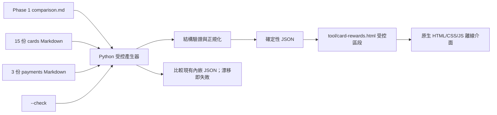

# 2026 下半年舊戶卡片回饋查詢工具設計

**日期：** 2026-08-18

**狀態：** 待使用者確認書面規格

**Phase 1 基線：** `fe59115a8ba40dd47d571d43f565e91682c64366`

**目標期間：** 2026-08-01 至 2026-12-31

**部署邊界：** repo 內、單一 HTML、完全離線；本階段不部署、不推送、不發布

## 1. 背景與目的

Phase 1 已完成 15 項卡片／金融卡產品、3 項行動支付及跨產品比較的官方證據語料庫。Phase 2 將此核准資料轉為一個類似 Claude artifact 的互動式查詢工具，讓使用者能以卡名、銀行、場景、店家或支付方式快速找出：

- 國內、國外與特殊回饋。
- 舊戶必須完成的任務、登錄、名額與消費門檻。
- 回饋上限及已在 Phase 1 標明的推導可刷額。
- 回饋貨幣、有效期間、覆蓋狀態與官方來源。
- LINE Pay、iPASS MONEY、全支付的已確認相容性與未確認範圍。

工具是 Phase 1 Markdown 的查詢介面，不是第二套研究資料。所有回饋事實、期間、條件與不確定性仍以核准的 Markdown 為唯一內容來源。

## 2. 核准基線與資料範圍

Phase 2 以 commit `fe59115a8ba40dd47d571d43f565e91682c64366` 的下列資料為初始基線：

- `docs/card-rewards/2026-h2/comparison.md`：15 項產品總表、情境選擇、使用限制與產品腳註。
- `docs/card-rewards/2026-h2/cards/*.md`：15 份單卡證據文件。
- `docs/card-rewards/2026-h2/payments/*.md`：LINE Pay、iPASS MONEY、全支付 3 份矩陣。
- `docs/card-rewards/2026-h2/README.md`：研究範圍、覆蓋帳本與使用限制。

基線共有 18 份產品／支付文件，覆蓋狀態為 9 份 `complete`、9 份 `partial`、0 份 `unavailable`。`complete` 只代表官方證據覆蓋研究期間，不代表登錄成功、尚有名額或個人必然符合任務；工具必須保留這個語意。

若實作期間需要改動任何已核准回饋事實，必須先更新相應 Phase 1 Markdown、來源證據與比較表，通過既有語料庫驗證後，才可重新產生工具資料。不得直接修改 HTML 內的資料來繞過 Phase 1。

## 3. 目標

1. 以單一 HTML 提供桌面與手機皆可使用的互動查詢介面。
2. 由受控 Python 產生器將核准 Markdown 轉成確定性內嵌 JSON。
3. 支援搜尋、場景篩選、最多 3 項產品並排比較及單卡詳細檢視。
4. 保留回饋貨幣、來源、限制與不確定性，不建立失真的跨貨幣排行。
5. 完全離線瀏覽既有資料；只有使用者主動開啟官方來源連結時才需要網路。
6. 用 `--check`、單元測試與實際瀏覽器 E2E 防止 Markdown、內嵌資料與介面行為漂移。

## 4. 非目標

- 不重新研究或擴充 Phase 1 未納入的信用卡。
- 不登入銀行、電子支付或個人帳戶，也不讀取個人消費資料。
- 不自動判斷使用者是否已登錄、達成資產門檻或仍有活動名額。
- 不把現金、刷卡金、LINE POINTS、台新 Point、玉山 e point、P幣、小樹點、Costco 好多金、一卡通綠點或全點換成共同價值。
- 不用單一數字宣稱「最佳卡」，也不將限量、抽獎、贈品或待確認項目視為保證回饋。
- 不在瀏覽器執行時抓取或解析 Markdown，不呼叫銀行 API。
- 不使用 React、套件管理器、CDN、外部字型、分析追蹤或遠端資源。
- 不在 Phase 2 自動部署網站、建立 PR、推送分支或公開發布。

## 5. 方案比較與決策

### 5.1 採用：受控產生器＋單檔 HTML

由 Python 標準函式庫解析 Phase 1 Markdown，建立結構化資料，再把確定性 JSON 寫入 `tool/card-rewards.html` 的受控標記區段。HTML 內含完整 CSS、JavaScript 與資料，不需要建置工具或執行時伺服器。

採用原因：

- 保留單檔、離線、可攜的 artifact 使用體驗。
- Markdown 仍是唯一來源，避免人工同步兩份資料。
- `--check` 可在測試或維護時直接偵測資料漂移。
- 適合 repo 既有的自包含 HTML 工具慣例。

### 5.2 不採用：人工維護 JavaScript 物件

人工抄錄 Phase 1 資料到 HTML 雖然起步快速，但更新時容易漏掉條件、來源、期間或 `partial` 缺口，且難以證明 HTML 與 Markdown 一致，因此不採用。

### 5.3 不採用：瀏覽器執行時讀取 Markdown

`file://` 環境對相對路徑 `fetch()` 有瀏覽器安全限制，且多檔案相依會破壞單檔交付。執行時解析 Markdown也會增加錯誤處理與跨瀏覽器差異，因此不採用。

### 5.4 不採用：框架式 Web App

React、Vue 或遠端元件庫會引入依賴、建置產物與離線資產管理，對本工具的固定資料量沒有必要。此工具使用原生 HTML、CSS、JavaScript。

## 6. 檔案與責任邊界

Phase 2 預計新增：

```text
tool/card-rewards.html
scripts/build_card_rewards_tool.py
tests/test_card_rewards_tool.py
docs/superpowers/plans/2026-08-18-card-rewards-tool.md
```

預計修改：

```text
index.html
README.md
tests/test_index_navigation.py
```

本設計文件為：

```text
docs/superpowers/specs/2026-08-18-card-rewards-tool-design.md
```

責任分工：

- `docs/card-rewards/2026-h2/`：事實、證據、期間與不確定性的唯一來源。
- `scripts/build_card_rewards_tool.py`：只做結構驗證、確定性轉換與受控資料注入，不重新解讀回饋。
- `tool/card-rewards.html`：離線介面與產生器注入的唯讀資料快照。
- `tests/test_card_rewards_tool.py`：資料契約、產生器、離線結構與前端靜態契約測試。
- `tests/test_index_navigation.py`：首頁導覽與相對連結回歸測試。

## 7. 系統架構與資料流



產生流程只允許單向由 Markdown 到 HTML。瀏覽器不回寫資料，HTML 也不反向覆蓋 Markdown。

## 8. 確定性資料產生契約

### 8.1 輸入契約

產生器必須讀取並驗證：

1. `comparison.md` 的 `## 15 項產品總表`：恰好 15 個資料列、每列 10 欄、每列一個唯一且已知的內嵌 `product-id`。
2. 每列產品腳註：恰好對應 `cards/<product-id>.md`。
3. 15 份卡片 frontmatter：`product`、`issuer`、`product_type`、`customer_scope`、`target_from`、`target_to`、`verified_at`、`coverage_status` 全部存在且合法。
4. 每份卡片固定章節：結論摘要、一般回饋、特殊回饋、行動支付相容性、排除交易、來源證據、不確定事項。
5. 3 份支付矩陣：各恰好 15 項產品列；每個「使用者產品」名稱必須可和 comparison 的唯一產品列一對一對應，再由該列取得 stable product ID。名稱無法對應、重複對應或集合不一致時均視為錯誤。
6. `README.md` 的查證基準日、目標期間與覆蓋計數可與文件集合互相核對。

任一輸入缺欄、重複、未知 ID、路徑不符、產品集合不一致或覆蓋計數不一致時，產生器必須非零結束，不得產出部分資料。

### 8.2 轉換原則

- 比較表欄位以文字保留，不把百分比或點數擅自轉成共同數值。
- 單卡正文的固定章節以已清理但語意不變的 Markdown／純文字片段保留，供詳細檢視。
- 特殊回饋表、一般回饋表及支付矩陣可轉為欄位陣列，但不得重新計算或合併 Phase 1 未明示的回饋。
- 官方來源從 `來源證據` 章節擷取；來源序號、標題、有效期間註記與 URL 必須保留。
- `derived`、`limited`、`registration`、`partial`、`nonGuaranteed` 標記只能由明確文字或結構規則產生；不確定時不自動加強語意。
- 產生順序固定，JSON key 排序與序列化格式固定，不寫入每次執行都會改變的 build timestamp。
- 顯示的查證日使用 Phase 1 `verified_at`／README 查證基準日，不以產生當下時間取代。

### 8.3 內嵌資料標記

HTML 使用唯一、可測試的受控區段，例如：

```html
<!-- CARD_REWARDS_DATA_START -->
<script id="card-rewards-data" type="application/json">...</script>
<!-- CARD_REWARDS_DATA_END -->
```

產生器只可覆寫兩個標記之間的 JSON，不得機械改寫 HTML 其他區域。標記遺失、重複或順序錯誤時必須失敗。

### 8.4 命令介面

預定介面：

```powershell
python scripts/build_card_rewards_tool.py
python scripts/build_card_rewards_tool.py --check
```

- 預設模式：驗證輸入後更新 HTML 的受控資料區段。
- `--check`：重新建立預期 JSON 並與 HTML 內嵌資料逐位元組比較；一致為 exit 0，漂移或輸入錯誤為非零。
- 錯誤訊息必須指出文件、契約與問題類型，不輸出模糊的「解析失敗」。

## 9. 內嵌資料模型

資料根節點採明確版本化契約：

```text
CardRewardsDataset
├─ schemaVersion
├─ auditDate
├─ targetFrom
├─ targetTo
├─ baselineCommit
├─ coverageCounts
├─ cards[15]
├─ payments[3]
└─ scenarios[]
```

### 9.1 根節點

| 欄位 | 型別 | 說明 |
|---|---|---|
| `schemaVersion` | string | 初版固定為 `1`；不相容欄位變更才升版 |
| `auditDate` | ISO date | Phase 1 查證基準日 |
| `targetFrom` | ISO date | `2026-08-01` |
| `targetTo` | ISO date | `2026-12-31` |
| `baselineCommit` | string | 本設計核准的 Phase 1 起始 commit；若證據依法更新，另由實作計畫規範更新方式 |
| `coverageCounts` | object | `complete`、`partial`、`unavailable` 計數 |
| `cards` | array | 15 項產品，依 comparison 表順序 |
| `payments` | array | LINE Pay、iPASS MONEY、全支付 |
| `scenarios` | array | comparison 的情境選擇內容與產品引用 |

### 9.2 卡片節點

每張卡至少包含：

```text
CardRecord
├─ id
├─ product
├─ issuer
├─ productType
├─ customerScope
├─ targetFrom / targetTo / verifiedAt
├─ coverageStatus
├─ evidencePath
├─ comparison
│  ├─ domestic
│  ├─ overseas
│  ├─ bestSpecial
│  ├─ conditions
│  ├─ capAndDerivedSpend
│  ├─ linePay
│  ├─ ipassMoney
│  └─ pxPay
├─ sections
│  ├─ summary
│  ├─ generalRewards
│  ├─ specialRewards
│  ├─ paymentCompatibility
│  ├─ exclusions
│  └─ uncertainties
├─ sources[]
├─ searchAliases[]
└─ badges[]
```

`comparison` 欄位完整保留比較表顯示文字。`sections` 保存單卡證據細節；表格需轉為標題列與資料列，敘述段落保留安全的文字結構。`sources[]` 至少包含來源標籤、描述與官方 URL。`searchAliases[]` 由確定性規則建立，例如正式卡名、comparison 顯示名、銀行名、英文產品名、`@GoGo`／`Richart` 等資料中已出現的別名，不另創造市場名稱。

### 9.3 支付節點

每個支付服務包含：

```text
PaymentRecord
├─ id
├─ name
├─ coverageStatus
├─ evidencePath
├─ summary
├─ rows[15]
│  ├─ productId
│  ├─ productLabel
│  ├─ supported
│  ├─ originalCardOrAccountReward
│  ├─ platformReward
│  ├─ stacking
│  └─ notes
├─ sources[]
└─ uncertainties
```

`productLabel` 保留支付矩陣原始產品名稱；`productId` 由 comparison 的唯一名稱對應取得，而不是要求支付 Markdown 另藏一套 ID。`supported` 必須保留 Phase 1 對 `supported`、`not officially confirmed` 或其他既有狀態的原意。不得把未知改成不支援，也不得因技術上可綁卡就推論能取得原卡回饋。

### 9.4 情境節點

`comparison.md` 的情境標題與項目轉為：

```text
ScenarioRecord
├─ id
├─ title
├─ entries[]
│  ├─ text
│  └─ productIds[]
└─ searchTerms[]
```

情境項目用於搜尋提示與情境瀏覽，不轉成跨貨幣分數或自動排名。

## 10. 資訊架構

單頁由五個區域組成：

1. **頁首與資料狀態**：工具名稱、目標期間、查證日、15 項產品、覆蓋計數及「只適用舊戶」聲明。
2. **搜尋與快速篩選**：單一搜尋框、場景 chips、覆蓋狀態與產品類型篩選。
3. **產品卡片網格**：15 張摘要卡，以篩選後結果顯示。
4. **比較列**：固定顯示目前已選的 0–3 項產品，提供並排比較入口。
5. **詳細面板**：檢視單卡完整條件、支付相容性、不確定事項與官方來源。

首次載入顯示全部 15 項產品，不預設「最佳」排序。初始順序沿用 Phase 1 comparison，避免產生未經核准的優先級。

## 11. 搜尋、篩選與比較行為

### 11.1 搜尋

搜尋不分英文字母大小寫，忽略前後空白，涵蓋：

- 卡片名稱、銀行、產品別名。
- 國內、海外、網購、實體、訂閱、交通等情境文字。
- 店家與活動名，例如 Costco、路易莎、Hotels.com。
- LINE Pay、iPASS MONEY、全支付。
- 回饋貨幣與條件文字。

搜尋結果必須顯示命中數。無結果時顯示清楚的空狀態及「清除全部條件」操作，不靜默留下空白畫面。

### 11.2 快速篩選

主要場景 chips：

- 國內
- 國外
- 網購
- 交通
- 數位訂閱
- LINE Pay
- iPASS MONEY
- 全支付

另提供：

- 產品類型：信用卡、簽帳金融卡、ATM／功能未確認。
- 覆蓋狀態：完整、部分、無資料。

不同篩選群組採 AND，同群組多選採 OR。篩選狀態可清除，重新載入頁面則回到全部產品；初版不要求寫入 URL 或永久保存。

### 11.3 最多 3 項並排比較

- 每張摘要卡提供「加入比較」勾選。
- 最多選 3 項；選到上限後，其餘未選按鈕停用並說明上限。
- 比較欄依序呈現產品、國內一般、國外一般、最佳特殊回饋、條件、上限／推導可刷額、三種支付與覆蓋狀態。
- 窄螢幕使用水平捲動或直向分組，不縮小到無法閱讀。
- 現金與不同點數維持原文字，不計算統一分數、不自動標示勝者。

## 12. 產品摘要卡與詳細面板

### 12.1 摘要卡

每張卡片至少顯示：

- 銀行、產品名與產品類型。
- 國內一般、國外一般。
- 最佳特殊回饋摘要。
- 主要條件或上限摘要。
- 覆蓋狀態與必要風險 badges。
- 「查看詳情」及「加入比較」。

摘要不可只顯示最高百分比而隱藏「僅至 9/30」、「須登錄」、「限量」或回饋貨幣。

### 12.2 詳細面板

桌面使用右側 drawer；手機使用接近全螢幕的 bottom sheet。內容順序：

1. 結論摘要與證據狀態。
2. 一般回饋。
3. 特殊回饋。
4. LINE Pay、iPASS MONEY、全支付相容性。
5. 排除交易。
6. 不確定事項／未覆蓋期間。
7. 官方來源與證據 Markdown 相對連結。

面板開啟後焦點移至標題，Esc、關閉按鈕與點擊遮罩可關閉；關閉後焦點回到原本按鈕。面板內需限制鍵盤焦點，背景不可誤操作。

## 13. 狀態與警示標記

工具至少使用以下文字＋圖示／色彩雙重提示，不得只靠顏色：

| 標記 | 顯示條件 | 使用者語意 |
|---|---|---|
| `部分期間` | `coverage_status: partial` | 研究視窗有未覆蓋或衝突區間，不可外推 |
| `需登錄` | Phase 1 明示登錄 | 未登錄不保證取得 |
| `限量` | 有名額、總量或額滿即止 | 顯示率不是保證回饋 |
| `推導值` | Phase 1 明標推導可刷額 | 非官方直接公告的消費額 |
| `非保證` | 限量、條件式最高或抽取型資訊 | 不應視為固定收益 |
| `來源衝突` | Phase 1 明示官方條款矛盾 | 採保守交集或不提出定量 |
| `未確認` | 缺特定產品正面證據 | 不等於 0% 或技術上不能使用 |

`complete` 不使用「保證」字眼。所有 badges 必須有可讀文字與 `aria-label` 或等價可存取名稱。

## 14. 視覺設計

整體採資訊密度適中、偏金融資料工具的視覺語言：

- 主色為深海軍藍，背景為暖白；警示使用琥珀色、錯誤／衝突使用磚紅色、完整覆蓋使用低飽和綠色。
- 不載入外部字型；使用可在 Windows、macOS、iOS、Android 回退的系統字型 stack。
- 百分比、金額與期間使用等寬數字特性或系統等寬 fallback，方便掃讀。
- 卡片以清楚邊界、留白與標題層級組織，不使用裝飾性漸層或會掩蓋資料的圖表。
- 桌面以 3 欄為主，平板 2 欄，手機 1 欄；不依固定裝置名稱，而以內容能否自然閱讀決定 breakpoint。
- 比較資料與來源保留足夠行高，不以截斷省略關鍵條件；摘要可限行，但詳細面板必須顯示完整文字。

本工具不使用圓餅圖、長條圖或雷達圖，因不同回饋貨幣與條件無法形成可靠共同尺度。

## 15. 響應式與可存取性

- 支援鍵盤完整操作：搜尋、篩選、卡片、比較、drawer／bottom sheet、來源連結。
- 所有互動控制使用原生 `button`、`input`、`a` 等語意元素，不用只有 click handler 的 `div`。
- 焦點樣式清楚可見，顏色對比以 WCAG AA 為目標。
- 搜尋結果數、篩選變化與比較上限提示使用適當的 live region，但避免每次鍵入造成冗長朗讀。
- 尊重 `prefers-reduced-motion`；動畫不是理解內容的必要條件。
- 觸控目標至少約 44×44 CSS px，bottom sheet 的關閉控制固定可見。
- 詳細表格在窄螢幕可水平捲動，並保留可辨識欄名；不可讓表格溢出整頁造成雙層難以控制的水平捲動。

## 16. 離線、安全與隱私邊界

- `tool/card-rewards.html` 以 `file://` 直接開啟時即可使用全部查詢功能。
- HTML 不含外部 script、stylesheet、font、image、iframe、analytics 或執行時 `fetch`。
- 官方來源連結可指向 HTTPS 官方網站，只有使用者點擊後才離開離線工具；外部連結使用安全的 `rel="noopener noreferrer"`。
- Markdown 轉入 HTML 前必須經白名單式輸出／escaping，不直接把未處理的 Markdown 當 `innerHTML`。
- 前端建立動態文字時優先使用 `textContent` 與 DOM API；若有受控 HTML formatter，只允許固定標籤並經測試。
- 不使用 localStorage 儲存金融或個人消費資料。初版介面狀態只存在當次頁面記憶體。
- 不蒐集、傳送或記錄使用者查詢內容。

## 17. 失敗與不完整資料行為

### 17.1 建置期

- 輸入契約失敗：停止產生，列出精確檔案與錯誤，不留下半更新 HTML。
- 受控資料標記失效：停止並要求人工修正標記。
- JSON 序列化或寫入失敗：原檔保持不變；寫入採先產生完整內容再原子替換的方式。
- `--check` 漂移：非零結束，明示需要重新產生或先修正 Phase 1 資料。

### 17.2 執行期

- 內嵌資料遺失或 schema 不支援：顯示可見的錯誤面板，不呈現空白頁，也不嘗試連網補資料。
- 單一產品缺非必要欄位：在測試／產生階段即攔截；正式 HTML 不應以猜測預設值掩蓋。
- `partial`、來源衝突、未確認：照原始狀態顯示，不用前端邏輯補值。
- 搜尋無結果：提供清除搜尋與篩選的復原操作。

## 18. 首頁與 README 整合

完成工具後：

- `index.html` 的信用卡回饋入口改為相對路徑 `tool/card-rewards.html`。
- 根目錄 `README.md` 的對應入口改連 repo 內工具，說明它是 2026 下半年舊戶資料快照。
- 既有 Claude public artifact 只可作歷史參考，不作為目前工具資料來源或預設入口。
- 導覽文字需說明查證基準日與資料期間，避免使用者誤以為是即時銀行資料。

## 19. 測試策略

### 19.1 產生器與資料契約測試

至少涵蓋：

- 15 張卡、3 個支付服務與相同 product ID 集合。
- comparison 15×10 表格、唯一 inline ID、唯一腳註與正確證據路徑。
- frontmatter 必要欄位、固定章節、合法日期與覆蓋狀態。
- 支付矩陣各 15 列且無缺列、重複或未知產品。
- 來源 URL 與描述可保留。
- JSON 輸出確定性；連續產生結果相同。
- `--check` 對一致資料 exit 0，對故意修改的內嵌資料非零。
- 缺標記、重複標記、缺卡片、欄數錯誤、未知 ID 等失敗案例。
- 輸出不含不必要 build timestamp 或機器絕對路徑。

### 19.2 HTML 離線與安全結構測試

至少涵蓋：

- 只有一個正確的內嵌 JSON 節點。
- 無外部 script、stylesheet、font、image、iframe 或 runtime fetch。
- 所有官方來源為 HTTPS，外部連結有安全 `rel`。
- 介面必要 landmarks、搜尋欄、篩選控制、比較區與詳細面板存在。
- 15 項產品與 coverage badges 可由內嵌資料建立。
- Markdown 特殊字元與惡意樣本被安全輸出，不可執行注入內容。

### 19.3 前端行為測試

至少涵蓋：

- 卡名、銀行、別名、店家、情境與支付方式搜尋。
- 同群組 OR、跨群組 AND、清除全部與無結果狀態。
- 最多 3 項比較、解除選取及上限提示。
- 詳細面板開關、Esc、焦點回復、鍵盤操作。
- `partial`、限量、需登錄、推導值、未確認等狀態顯示。
- 不同回饋貨幣不被自動加總或標示共同勝者。

### 19.4 實際瀏覽器 E2E

必須在實際瀏覽器以 repo 內 HTML 驗證：

- 桌面寬度：載入、搜尋、篩選、選 3 卡比較、開啟來源與詳細面板。
- 手機寬度：單欄卡片、bottom sheet、觸控篩選、比較橫向／直向閱讀、關閉與返回焦點。
- 斷網或阻擋網路時，除官方外連外所有既有資料與操作正常。
- 瀏覽器 console 無未處理錯誤。

E2E 必須記錄使用的 viewport、主要步驟與結果；只通過靜態單元測試不足以宣稱 Phase 2 完成。

### 19.5 回歸與交付驗證

完成前重新執行：

- Phase 1 語料庫既有全部測試與 validator。
- Phase 2 新增測試。
- 首頁導覽測試。
- Python `py_compile`。
- 產生器 `--check`。
- `git diff --check` 與明確範圍稽核。

## 20. 驗收條件

Phase 2 完成需同時符合：

1. `tool/card-rewards.html` 可由 `file://` 完全離線開啟並使用。
2. 15 項產品、3 項支付與 Phase 1 的覆蓋狀態全部存在。
3. 搜尋、場景篩選、最多 3 項比較與單卡詳細檢視可用。
4. 回饋率、貨幣、條件、登錄、限量、上限、推導可刷額、期間及官方來源可追溯至 Phase 1。
5. `partial`、未確認、來源衝突及非保證活動沒有被介面淡化或外推。
6. 不進行跨回饋貨幣自動排名或換算。
7. 產生器能重建資料，`--check` 能可靠偵測漂移。
8. HTML 無外部執行時依賴、分析追蹤或自動網路請求。
9. 桌面與手機實際瀏覽器 E2E 均通過，console 無未處理錯誤。
10. `index.html` 與根 `README.md` 已改連 repo 內工具。
11. Phase 1 validator、Phase 2 測試、導覽測試、py_compile、`--check` 與 diff check 全數通過。
12. 只修改核准範圍，未碰觸 main 工作樹的無關變更，也未推送、部署或發布。

## 21. 版本控制與發布邊界

- 實作持續在 `.worktrees/card-rewards-2026-h2`／`codex/card-rewards-2026-h2` 完成。
- 每次只 stage 設計、計畫、工具、產生器、測試、首頁與 README 的明確路徑。
- Phase 1 事實若需更新，使用獨立且可審查的 evidence commit，再重新產生 HTML。
- Phase 2 可建立本機 commits 供審查；不得自動 push、merge、部署、建立 PR 或公開 repo。
- 使用者另行核准發布前，Claude artifact 與新工具均維持本機／歷史參考狀態。

## 22. 後續流程

1. 使用者確認本書面設計規格。
2. 依本規格撰寫逐步 implementation plan，明列檔案、測試與驗證命令。
3. 依 plan 以測試先行方式實作產生器、HTML 與導覽整合。
4. 執行 fresh-context review、完整驗證與桌面／手機 E2E。
5. 交付本機成果與剩餘風險；發布、推送或合併另行取得授權。
